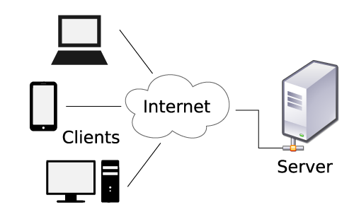

# World of Tech

*Sales Summit 2018*

Overview of some of the most common technologies you can expect to encounter in a tech course for enterprise clients.

--- 

### Agenda 

- Why is this Important?
- Tools
  - CLI
  - Code Editors
  - Git + Version Control 
- How the Web Works
- Front-end
  - HTML/CSS
  - JavaScript (Client-side)
- **Break**
- Back-end
  - Back-end Languages
  - API's
  - Databases
- Front-end Frameworks
- Q&A

---

### Bio 

- Professional development since 2002
- 7 WDI cohorts in ATX starting with WDI-1
- First cohort at Capital One Developer Academy  

## Why is this Important?
> 5 min
> 
> Why it's important to understand the concepts in this presentation

## Tools 

### CLI 
> 10 min 
> 
> Why we teach students to be proficient with the command line and terminal

- There are things that can't be accomplished with a GUI, mainly because nobody bothered to write a GUI for that functionality
- Automation. You can write scripts that perform any series of actions and have complete control over what happens
- Because Unix was written from the terminal up, most everything can be configured through the command line
- It's much quicker to type in commands then to go through endless menu options to find what you're looking for

## EXERCISE

- Open the terminal by pressing `Command` + `Spacebar`
- Type in **terminal** and hit `Enter`
- `cd ~/Desktop` to navigate to the desktop
- `touch quote.txt` to create a file named **quote.txt**
- `open quote.txt` to edit the file
- Type in **Who looks outside, dreams; who looks inside, awakens** and hit `Enter`
- Save the file and close it
- `cat quote.txt` to view the contents of the file we created

### Code Editors 
> 2 min

- General Development 
	- [Atom](https://atom.io/)
	- [Sublime](https://www.sublimetext.com/)
- Java 
	- [Eclipse](https://www.eclipse.org/ide/)
	- [IntelliJ](https://www.jetbrains.com/idea/)
- ASP.NET
	- [Visual Studio](https://code.visualstudio.com/)
- iOS
	- [Xcode](https://developer.apple.com/xcode/)
- Street Cred
	- [Vim](http://www.vim.org/)

## EXERCISE

- `cd ~/Desktop`
- `vim quote.txt`
- `h` to move left, `l` to move right
- `w` to jump to the next word. `b` to jump back one word
- `A` to append the author to the end of the quote **Carl Jung**
- `ESC` when you're done editing
- `:wq` to save the file and exit

> To generate a truly random string, put a web developer in front of Vim and tell them to exit 

### Git + Version Control
> 10 min
> 
> What is Git and why is version control critical for development teams

[Git](https://git-scm.com/book/en/v2/Getting-Started-About-Version-Control) allows developers to:

- Revert files back to a previous state
- Revert the entire project back to a previous state
- Compare changes over time
- See who last modified something that might be causing a problem
- See who introduced an issue and when

Git gives developers the freedom to explore and try new things without the worry of losing their work. For the most part data is added not deleted. 

## How the Web Works 
> 15 min
> 
> What do people mean when they say front-end/back-end? What's involved on either side?

## Front-end

### HTML/CSS 
> 10 min
> 
> What role does HTML, CSS play? How does the browser render that content (e.g. DOM)

- HTML provides the structure of the webpage (text, images, etc)
- CSS is about the appearance and styling (color, font size, etc)

### JavaScript - Client-side 
> 10 min
> 
> What's the difference between front-end JavaScript and back-end JavaScript? 

- Client-side JavaScript is for interactivity and runs in the browser
- Allows developers to hide/show content, provides richer experiences

## Break
> 5 min

## Back-end

### Languages 
> 20 min
> 
> Why are there so many back-end languages and how does this affect what we're selling and training students for? 

#### General

* JavaScript - Node.js, API's
* Python - Machine learning, AI
* PHP - Over 80% of the web runs on PHP
* Ruby - Popular among startups and medium size companies

#### Enterprise 

* Java - Proven, maintainability, Android
* ASP.NET - C#

### API's 
> 10 min
> 
> What's an API and what role do they play for different types of companies

### Databases 
> 10 min
> 
> What's a database and the differences between relational and NoSQL databases?

## Front-end Frameworks 
> 10 min

- React vs Angular
- ES6
- TypeScript

## Q&A
> 5 min

